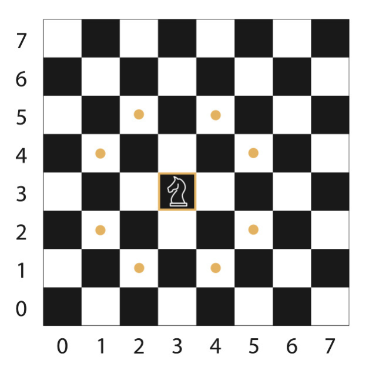

# Knight Travails!

## What is it?

-   This project applies the concept of [Breadth-First-Search (BFS)](https://www.geeksforgeeks.org/breadth-first-search-or-bfs-for-a-graph/) algorithm to find the shortest path from a starting point to an end point.
-   In this project, I modelled the concept through a 'knight' in the traditional game of Chess. For a knight, it can face any direction and can move in the following direction:

    1. Two steps forward/backward and one step to the side OR
    2. One step forward/backward and two steps to the side.

-   An example of all the possible moves you can make may look like this:

    

## Give it a test drive!

-   I've created a simple GUI that will allow you (the user) to set a start and end point and see how the knight will 'move' across the chessboard with respect to the above.
-   Simply visit the live preview [here](https://elishamutang.github.io/knight-travails/).

## Credits

-   Geeks for Geeks
-   The Odin Project
